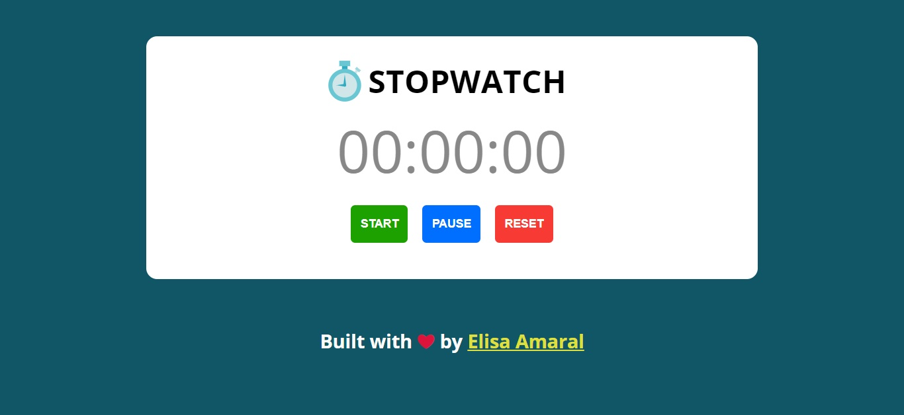
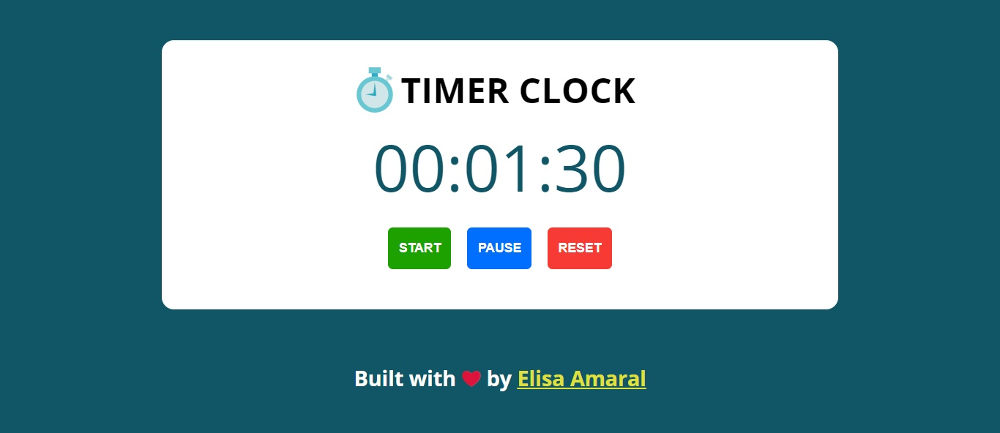
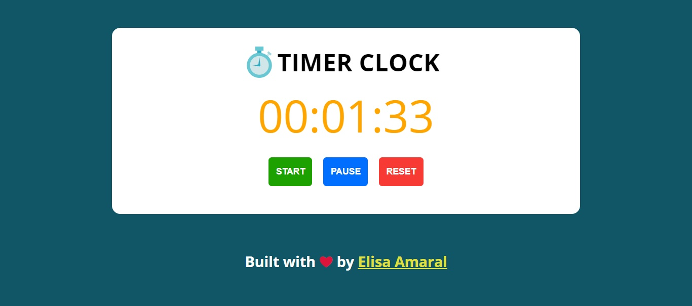

# Stopwatch

This project is a Stopwatch coded in JavaScript (Vanilla JS), HTML and CSS, responsive design was used in the development. The user can start, pause and reset the Stopwatch. 

## Project Link

**https://stopwatch-built-with-vanilla-js.netlify.app/**

## Screenshot 1: Stopwatch Not Started Yet or Reseted

## Screenshot 2: Stopwatch Started

## Screenshot 3: Stopwatch Paused

## Technology Stack

+ HTML
+ CSS
+ JavaScript (Vanilla JS)
