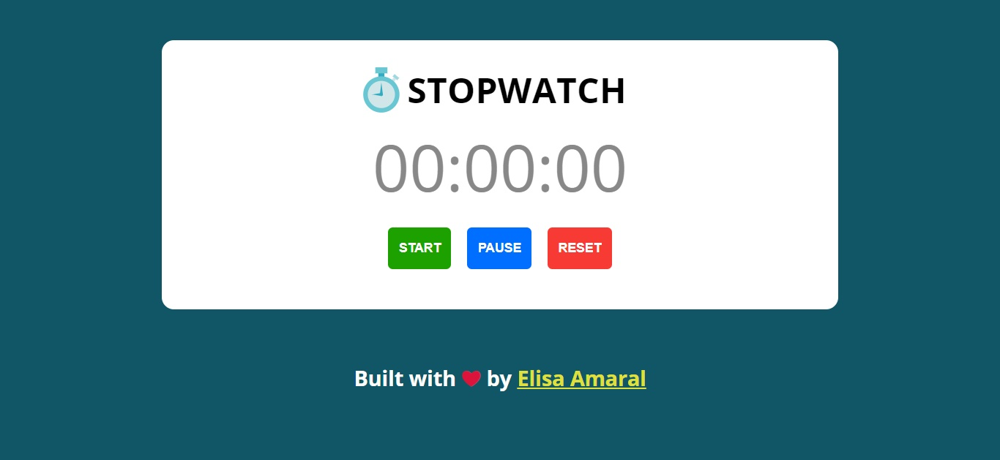
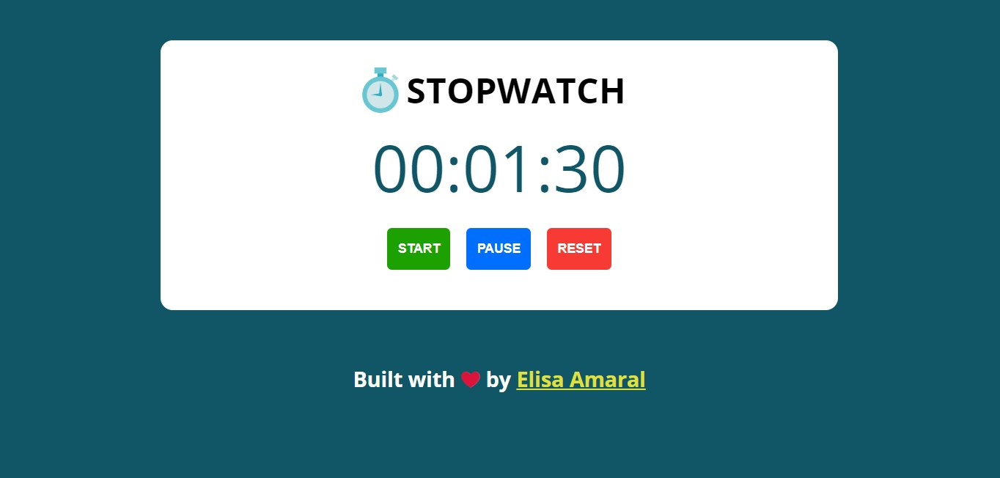
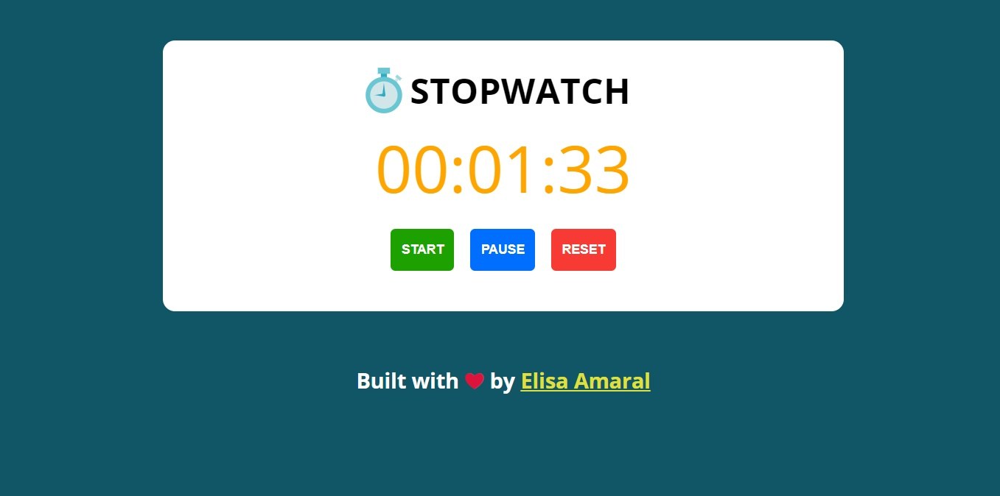

# Stopwatch

This project is a Stopwatch coded in responsive design. The user can start, pause and reset the Stopwatch. 

## Project Website

**https://stopwatch-built-with-javascript.netlify.app/**

## Screenshot 1: Stopwatch Not Started Yet or Reseted

## Screenshot 2: Stopwatch Started

## Screenshot 3: Stopwatch Paused

## Technology Stack

The project was built with:

+ JavaScript
+ HTML
+ CSS
